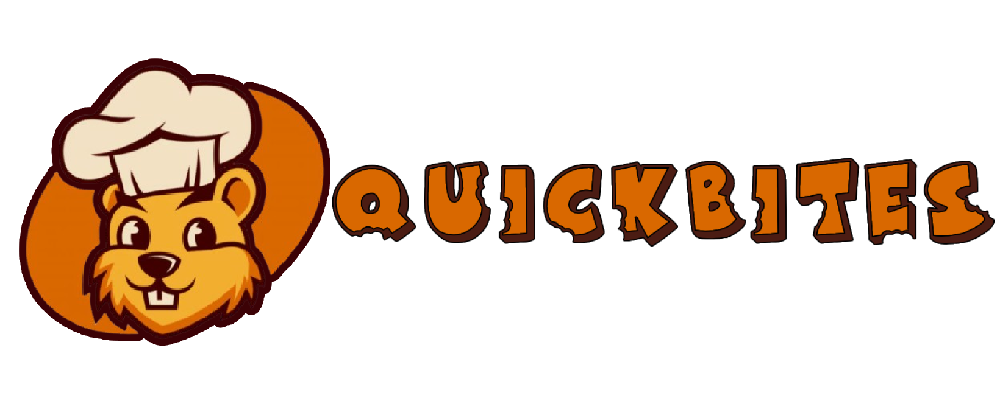

# QuickBites 🍽️

<p align="center">
  
</p>

<h1 align="center">QuickBites</h1>
<p align="center">🍽️ Cook. Publish. Share. Comment. A social recipe platform built with Laravel.</p>

<p align="center">
  <a href="#"></a>
  <a href="#"></a>
  <a href="LICENSE"></a>
</p>

---

## 🚀 Sobre o Projeto

**QuickBites** é uma plataforma social para entusiastas da culinária. Permite que usuários publiquem receitas, compartilhem ideias, comentem e descubram novos pratos em uma comunidade engajada.

Desenvolvido com **Laravel**, com foco em performance, usabilidade e uma arquitetura limpa.

> Projeto realizado em parceria com o **SENA**.

---

## 🤝 Parcerias Estratégicas

O QuickBites tem orgulho de contar com o apoio de grandes nomes da indústria alimentícia. Essas parcerias ampliam nossa rede de receitas e possibilitam conteúdos exclusivos para a comunidade.

<p align="center">
  <a href="https://www.mcdonalds.com/" target="_blank">
    
  </a>
  &nbsp;&nbsp;
  <a href="https://www.subway.com/" target="_blank">
    
  </a>
  &nbsp;&nbsp;
  <a href="https://www.nestle.com/" target="_blank">
    
  </a>
  &nbsp;&nbsp;
  <a href="https://www.outback.com/" target="_blank">
    
  </a>
  &nbsp;&nbsp;
  <a href="https://www.starbucks.com/" target="_blank">
    
  </a>
</p>

### 🍔 Receitas em Destaque

- **McDonald's®** – Receitas exclusivas inspiradas no menu clássico
- **Subway®** – Crie seus próprios sanduíches com os ingredientes mais amados
- **Nestlé®** – Dicas e truques culinários com produtos da linha Nestlé
- **Outback Steakhouse®** – Pratos temáticos e campanhas promocionais sazonais
- **Starbucks®** – Bebidas e cafés especiais para recriar em casa

> 💼 Se você representa uma marca e deseja se tornar parceira do QuickBites, entre em contato via [parcerias@quickbites.com](mailto:parcerias@quickbites.com)

---

## 🛠️ Tecnologias

- ⚙️ **Laravel** — Backend e lógica de aplicação  
- 💾 **MySQL/PostgreSQL** — Persistência de dados  
- 🎨 **Blade / Bootstrap / Tailwind CSS** — Frontend elegante e responsivo

---

## 📸 Funcionalidades

- Cadastro e login de usuários
- Publicação de receitas com imagem, descrição e ingredientes
- Comentários e interações sociais
- Sistema de busca por categorias e ingredientes
- Área do usuário para gerenciar receitas

---

## 📦 Instalação

Clone o projeto e instale as dependências:

```bash
git clone https://github.com/TiagoF24/quickbites.git
cd quickbites

composer install
cp .env.example .env
php artisan key:generate

# Configure o banco de dados no arquivo .env
php artisan migrate
php artisan serve
